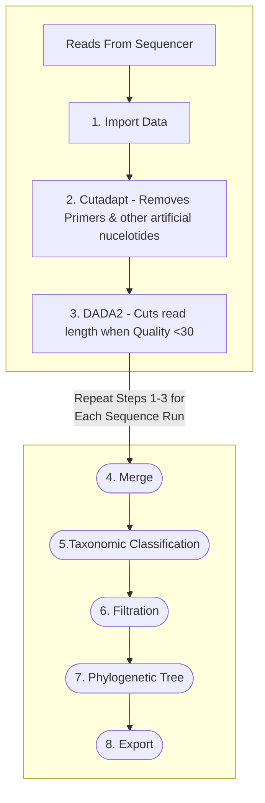

# Qiime2 Pipeline :microbe:
**Project Context:** Approximately 2,500 coral fragments of the reef-building coral, Orbicella faveolata comprising 179 unique genotypes were exposed to Stony Coral Tissue Loss Disease (SCTLD) in 2021 at Mote Marine Laboratory for a Florida DEP Funded Project.

Here, we process ~1650 of those samples through the Qiime2 pipeline for 16s microbial ecology analysis.
Leveraging 192 unique barcodes, we performed the library prep in house and sequenced the samples across 9 sequencing runs (192 samples/run). 

> Sequenced the 515F to 806R V4 region of the 16s rRNA on an Illumina MiSeq v3 PE300 with a target read count of 20 Million/run or ~100,000/sample.

## Overview



**Note:** Steps 1-3 below was applied to each sequencing run. Rather than combine all 9 runs into one script, I provided simply the first run ("D1D2") to demonstrate how each run was processed. The analysis steps from 1-3 are the same for each run, and then each run is merged together at step 4. 

## Reads from Sequencer

I hate to kickoff a tutorial without a solid roadmap but the first hurdle is transferring the reads from your sequencer to your server/computer/external hard drive of preference. This process is going to be specific to who your sequencer is. If they are in the USA, its likely they could upload the data to a storage repository equivalent to dropbox, box, or Illumina Basespace. This simply requires you to download by the click of a button. If they are international, it may be a server-to-server transfer using the "curl" command in terminal or you can try FileZilla as suggestions. If you are lost, reach out to your sequencer and hopefully they will have a standard operating procedure on how to transfer data or suggest steps on how to receive the data.

For this project, the data was uplaoded to box.com and we simply downloaded the data to our computers. Looking at the path below, beyond "Desktop/Ofav\ SCTLD/Raw\ Data/" you can see the path "D1D2-230117_M02476_0565_000000000-KRVDW/Alignment_1/20230120_001152" of how the data was saved by the sequencer, which for us was UMiami Medical Center. Some notation interpretation, I see the date the samples began being read on the Miseq v3 (230117) or Jan 17th 2023, and it takes three days to run, so we can see when the sequencing run was compeleted on (20230120) or Jan 20th 2023. Perhaps your data path has similar clues. 

Within this path is a folder called "Fastq", in it are the .fastq files for each sample that we care about. There are also extra files that dont need to be in here such as the FastqSummarF1L1.txt and two Undetermined files. I removed these files from the Fastq folder and placed them in the parent folder because they prevent the import data file from working as intended and are not relevant to our research investigation.
```
cd Desktop/Ofav\ SCTLD/Raw\ Data/D1D2-230117_M02476_0565_000000000-KRVDW/Alignment_1/20230120_001152

mkdir ./DemultiplexedSeqs
mv ./Fastq/FastqSummaryF1L1.txt ./../
mv ./Fastq/Undetermined* ./../
```

## Activate Qiime2 
```
conda activate qiime2-2022.11
```
***Your Qiime2 version will likely be more recent than mine.***

# 1. Import Data

With this style of import, the samples are ALREADY Demultiplexed.

Importing Data - **Casava 1.8 paired-end demultiplexed fastq**

**Note:** You will receive files in different formats from your sequencer. It may not be exactly like mine. For example in my [White Plague Qiime2](https://github.com/nmacknight/Qiime2-WhitePlague/blob/main/White%20Plague%202017%20-%20Educational%20Qiime%202Pipeline.md) page you can see the import style is different. Variation in how you import data are primarly based on if your reads are single-end v paired-end reads, barcoded or not, or demultiplexed or still multiplexed.

In this project, my reads are paired-end demultiplexed reads that were received in a format that reflects the Casava 1.8 paired-end demultiplexed fastq style. 

To read up on which import style is best for your project checkout Qiime2's [Importing Data](https://docs.qiime2.org/2023.2/tutorials/importing/) page.

**Casava 1.8 paired-end demultiplexed fastq**
```
qiime tools import \
  --type 'SampleData[PairedEndSequencesWithQuality]' \
  --input-path Fastq \
  --input-format CasavaOneEightSingleLanePerSampleDirFmt \
  --output-path ./DemultiplexedSeqs/demux-paired-end.qza
```
>Run Time: 20 min

Summary of the demultiplexing results
```
qiime demux summarize \
  --i-data ./DemultiplexedSeqs/demux-paired-end.qza \
  --o-visualization ./DemultiplexedSeqs/demux-paired-end.qzv
```
> RUN TIME: 12 Min.

**View The Interactive Plot.**
```
qiime tools view ./DemultiplexedSeqs/demux-paired-end.qzv
```
> RUN TIME: <1 min.

We will need to remove the adapters before the reads are truncated. To do this, we use Cutadapt in step 2.


# 2. Cutadapt :scissors:

**Removes Primer from Reads**

This trim-paired form of cutadapt will remove any nucelotides that are before and including the provided sequence on the front and reverse read of the sequence. This removes non-biological sequence data.

## Primers
**515F forward primer, barcoded**
1. 5′ Illumina adapter
2. Golay barcode
3. Forward primer pad
4. Forward primer linker
5. Forward primer (515F)
AATGATACGGCGACCACCGAGATCTACACGCT XXXXXXXXXXXX TATGGTAATT GT GTGYCAGCMGCCGCGGTAA

**806R reverse primer**

1. Reverse complement of 3′ Illumina adapter
2. Reverse primer pad
3. Reverse primer linker
4. Reverse primer (806R)
CAAGCAGAAGACGGCATACGAGAT AGTCAGCCAG CC GGACTACNVGGGTWTCTAAT

So in the command below you can see we used the Forward primer (515F) "GTGYCAGCMGCCGCGGTAA" and Reverse primer (806R) "GGACTACNVGGGTWTCTAAT" as our consistent artifical nucleotides to direct cutadapt to remove any nucleotides before the forward primer, or after the reverse primer. 
```
qiime cutadapt trim-paired \
  --i-demultiplexed-sequences ./DemultiplexedSeqs/demux-paired-end.qza \
  --p-front-f GTGYCAGCMGCCGCGGTAA \
  --p-front-r GGACTACNVGGGTWTCTAAT \
  --o-trimmed-sequences ./DemultiplexedSeqs/demux-paired-end-trimmed.qza
```
> Run time: (forgot to track this one, dont be mad.)

Summary of the demultiplexing results
```
qiime demux summarize \
  --i-data ./DemultiplexedSeqs/demux-paired-end-trimmed.qza  \
  --o-visualization ./DemultiplexedSeqs/demux-paired-end-trimmed.qzv
```

>RUN TIME: 12 Min.

**View The Interactive Plot.**
**Rule of Thumb:** ***Truncate when black bars begin to consistently go below a Quality Score of 30.***
```
qiime tools view ./DemultiplexedSeqs/demux-paired-end-trimmed.qzv
```
 Now that you have removed the primers, look at the first 40 nucleotides or so and you can see how the .qzv files differ between demux-paired-end.qzv and demux-paired-end-trimmed.qzv to visually confirm cutadapt removed your primers. 


# 3. DADA2

**Chops the read length where the quality begins to become poor.**
**Note:** Update the number after "--p-trunc-len-f" and "--p-trunc-len-r" to reflect YOUR cutoff point as determined after looking at the demux-paired-end-trimmed.qzv figures produced by the command above. While looking at the Interactive Plots tab in demux-paired-end-trimmed.qzv, you will see black bars begin to become lower in the graph. When these black bars consistently begin to reach a quality score of 30 or lower, I note that length (x-axis) where this begins and thats my cutoff length. Do this for both Forward and Reverse graphs.

```
mkdir ./DADA2
qiime dada2 denoise-paired \
  --i-demultiplexed-seqs ./DemultiplexedSeqs/demux-paired-end-trimmed.qza \
  --p-trim-left-f 0 \
  --p-trunc-len-f 280 \
  --p-trim-left-r 0 \
  --p-trunc-len-r 204 \
  --o-representative-sequences ./DADA2/rep-seqs-dada2.qza \
  --o-table ./DADA2/table-dada2.qza \
  --o-denoising-stats ./DADA2/stats-dada2.qza
```
> RUN TIME: 40 minutes for (463mb demux.qza)), or 14 hours (11gb demux.qza file). 
> File size depends on read depth and number of samples you are working with. 

Visualizing DADA2 output
```
qiime metadata tabulate \
  --m-input-file ./DADA2/stats-dada2.qza \
  --o-visualization ./DADA2/stats-dada2.qzv
qiime feature-table summarize \
  --i-table ./DADA2/table-dada2.qza \
  --o-visualization ./DADA2/table-dada2.qzv \
  --m-sample-metadata-file D1D2-metadata.tsv
qiime feature-table tabulate-seqs \
  --i-data ./DADA2/rep-seqs-dada2.qza \
  --o-visualization ./DADA2/rep-seqs-dada2.qzv
```
> Run Time < 1 min.

### Now Repeat these steps 1-3 above for each sequencing run before merging below 

#From her we are merging the data 
#For now we have the following datasets analyzed in Qiime2

**Note:** In the command below, the "--i-tables" are the directories of where the DADA2 results are stored from running the steps 1-3 for each specific sequencing run. We had 9 sequencing runs, so we ran steps 1-3 for each run, and have 9 unique ouput directories that need to be merged in step 4. 


# 4. Merging Sequencing Runs

Making a folder for all this work to go into:
```
cd /Users/nicholas.macknight/Desktop/Ofav SCTLD/Raw Data/
mkdir Merged
cd Merged
```

**Performing the merge command**
```
qiime feature-table merge \
  --i-tables ../D1D2-230117_M02476_0565_000000000-KRVDW/Alignment_1/20230120_001152/DADA2/table-dada2.qza \
  --i-tables ../D3D4-230120_M02476_0566_000000000-KT3CN/Alignment_1/20230123_004935/DADA2/table-dada2.qza \
  --i-tables ../D5D6-230123_M02476_0567_000000000-KT3F4/Alignment_1/20230125_225417/DADA2/table-dada2.qza \
  --i-tables ../D7D8-230127_M02476_0568_000000000-KRVYJ/Alignment_1/20230129_230519/DADA2/table-dada2.qza \
  --i-tables ../D9D18-230131_M02476_0569_000000000-KT4LR/Alignment_1/20230203_005408/DADA2/table-dada2.qza \
  --i-tables ../D11D10-230206_M02476_0570_000000000-KRNHM/Alignment_1/20230209_022123/DADA2/table-dada2.qza \
  --i-tables ../D12D13-230213_M02476_0571_000000000-KRVDL/Alignment_1/20230216_020440/DADA2/table-dada2.qza \
  --i-tables ../D14D15-230217_M02476_0572_000000000-KT4LV/Alignment_1/20230219_235336/DADA2/table-dada2.qza \
  --i-tables ../D16D17-230221_M02476_0573_000000000-KT3DP/Alignment_1/20230224_005823/DADA2/table-dada2.qza \
  --o-merged-table merged-table.qza
```
>Run time: < 1 min.

```
qiime feature-table merge-seqs \
  --i-data ../D1D2-230117_M02476_0565_000000000-KRVDW/Alignment_1/20230120_001152/DADA2/rep-seqs-dada2.qza \
  --i-data ../D3D4-230120_M02476_0566_000000000-KT3CN/Alignment_1/20230123_004935/DADA2/rep-seqs-dada2.qza \
  --i-data ../D5D6-230123_M02476_0567_000000000-KT3F4/Alignment_1/20230125_225417/DADA2/rep-seqs-dada2.qza \
  --i-data ../D7D8-230127_M02476_0568_000000000-KRVYJ/Alignment_1/20230129_230519/DADA2/rep-seqs-dada2.qza \
  --i-data ../D9D18-230131_M02476_0569_000000000-KT4LR/Alignment_1/20230203_005408/DADA2/rep-seqs-dada2.qza \
  --i-data ../D11D10-230206_M02476_0570_000000000-KRNHM/Alignment_1/20230209_022123/DADA2/rep-seqs-dada2.qza \
  --i-data ../D12D13-230213_M02476_0571_000000000-KRVDL/Alignment_1/20230216_020440/DADA2/rep-seqs-dada2.qza \
  --i-data ../D14D15-230217_M02476_0572_000000000-KT4LV/Alignment_1/20230219_235336/DADA2/rep-seqs-dada2.qza \
  --i-data ../D16D17-230221_M02476_0573_000000000-KT3DP/Alignment_1/20230224_005823/DADA2/rep-seqs-dada2.qza \
  --o-merged-data merged-rep-seqs.qza
```
>Run time: < 1 min.


**Summary of merged artifact**
*You will need to concatenate the other sequencing run metadata files to create "sample-metadata.tsv" in excel/Numbers. I did it in Numbers (the only time ive worked in this program over excel) because Numbers can export to .tsv files*
```
qiime feature-table summarize \
  --i-table merged-table.qza \
  --o-visualization merged-table.qzv \
  --m-sample-metadata-file sample-metadata.tsv
```
>Run time: < 1 min.

View
```
qiime tools view merged-table.qzv
```

```
qiime feature-table tabulate-seqs \
	--i-data merged-rep-seqs.qza \
	--o-visualization merged-rep-seqs.qzv
```
>Run Time <1 min.

## VSearch ##
**This vsearch command is clustering sequences that are 100% identical by referencing the merged-rep-seqs and then references the merged-table to ADD the frequencies (counts) of any clustered ASV.
```
qiime vsearch cluster-features-de-novo \
  --i-sequences ./merged-rep-seqs.qza \
  --i-table ./merged-table.qza \
  --p-perc-identity 1 \
  --o-clustered-table clustered-table.qza \
  --o-clustered-sequences clustered-seqs.qza
```
> Run Time: 5 min.


```
qiime feature-table summarize \
  --i-table clustered-table.qza \
  --o-visualization clustered-table.qzv \
  --m-sample-metadata-file sample-metadata.tsv
```
>Run time: < 1 min.

**View**
```
qiime tools view clustered-table.qzv

qiime feature-table tabulate-seqs \
	--i-data clustered-seqs.qza \
	--o-visualization clustered-rep-seqs.qzv
```
> Run Time <1 min.


# 5. Taxonomic Classification :paw_prints:

This is where we assign our ASV's (our representative sequences) a biological name.

We are using the silva database. There is also the greengenes database. At the time of this project (Feb 2023), the silva was more recently updated than the greengenes database. 

The qiime2 tutorial has a lot ot say about classifiers i.e. databases. Fortunately, the 515F to 806R is super common in microbial ecology analysis that they have these prepared ones for us. In my [White Plague Qiime2](https://github.com/nmacknight/Qiime2-WhitePlague/blob/main/White%20Plague%202017%20-%20Educational%20Qiime%202Pipeline.md) page you can see that I assembled my own classifier if you are curious on doing that and want an example. I used the greengenes for that one too but that was because at the time of that project (2017) the greengenes was not "outdated". 

Anyways, back to THIS project, where we use the silva database. 
```
qiime feature-classifier classify-sklearn \
  --i-classifier silva-138-99-515-806-nb-classifier.qza \
  --i-reads clustered-rep-seqs.qza \
  --o-classification taxonomy.qza
```
> Run time ~17 hours (merged-rep-seqs.qza was 12.7mb)

Visualize
```
qiime metadata tabulate \
  --m-input-file taxonomy.qza \
  --o-visualization taxonomy.qzv
```
>Run Time: < 1 min.

View
```
qiime tools view taxonomy.qzv
```

Visualize
```
qiime taxa barplot \
  --i-table clustered-table.qza \
  --i-taxonomy taxonomy.qza \
  --m-metadata-file sample-metadata.tsv \
  --o-visualization taxa-bar-plots.qzv
```
>Run Time: ~ 2 min.

View
```
qiime tools view taxa-bar-plots.qzv
```

**Filtering out Chloroplast and Mitochondria From Dataset**
There is a lot of chloroplast from Osteobium sp. perhaps. Lets remove them.
```
qiime taxa filter-table \
  --i-table clustered-table.qza \
  --i-taxonomy taxonomy.qza \
  --p-exclude mitochondria,chloroplast \
  --p-include d__Bacteria,d__Archaea \
  --o-filtered-table table-BacArc.qza
```
>Run Time: < 1 min.

```
qiime taxa filter-seqs \
  --i-sequences clustered-rep-seqs.qza \
  --i-taxonomy taxonomy.qza \
  --p-exclude mitochondria,chloroplast \
  --p-include d__Bacteria,d__Archaea \
  --o-filtered-sequences rep_seqs_BacArc.qza
```
>Run Time: < 1 min.

```
qiime feature-table summarize \
  --i-table table-BacArc.qza \
  --o-visualization table-BacArc.qzv \
  --m-sample-metadata-file sample-metadata.tsv
```
>Run Time: < 1 min.

```
qiime feature-table tabulate-seqs \
--i-data rep_seqs_BacArc.qza \
--o-visualization rep_seqs_BacArc.qzv
```
>Run Time: < 1 min.

```
qiime taxa barplot \
  --i-table table-BacArc.qza  \
  --i-taxonomy taxonomy.qza \
  --m-metadata-file sample-metadata.tsv\
  --o-visualization taxa-bar-BacArc.qzv
```
>Run Time: ~ 2 min.

```
qiime tools view taxa-bar-BacArc.qzv
```

# 6. Filtering

Purpose: In the previous step we performed taxonomic filtration. In this step we are filtering low abundant and low prevalent bacteria as they are likely not relevant to our questions. For example, if a bacteria was found in one sample and with a single read, its not likely biologically relevant. This is an extreme example but many bacteria have low abundance/prevalence and can be removed.

The second purpose in this step is to identify the minimum read depth that allows you to retain the most number of samples. To do this, play with the filtration parameters "--p-min-frequency" and "--p-min-samples" values from being 0 (not filtration) to gradually being more and more strict (higher values). Now this depends on your samples, but a good starting place is a min read depth of 10 or 100 and then min-sample values that range from 1% to 30% of your samples. In the example code below 12% of my samples was 195 samples. 

Document the results of these parameters on your dataset, specifically note two values. 1) the 1st quartile sample value from table-summarize function. This is the read depth that will result in 75% retention of your samples or a loss of 25% of your samples. 2) From the rarefaction curve, make a note of where the arc in the observed features begins to plateau. Subtract the difference between the 1st quartile value and the observational value you estimate from looking at the rarefaction curve. The filtration parameters that give you the least difference between those two values likely is giving you the best sample retention while observing the maximum number of unique ASVs.

Min Read depth of 10
```
qiime feature-table filter-features \
  --i-table table-BacArc-cl.qza \
  --p-min-frequency 10 \
  --o-filtered-table ./RarefactionClustered/table-BacArc_Fr10.qza
```

Min Frequency of 12% samples
```
qiime feature-table filter-features \
  --i-table ./RarefactionClustered/table-BacArc_Fr10.qza \
  --p-min-samples 195 \
  --o-filtered-table ./RarefactionClustered/table-BacArc_Fr10S195.qza
```
```
qiime diversity alpha-rarefaction \
  --i-table ./RarefactionClustered/table-BacArc_Fr10S195.qza \
  --p-max-depth 20000 \
  --m-metadata-file metadata.sub.tsv \
  --o-visualization ./RarefactionClustered/table-BacArc_20k_Fr10S195.qzv
```
```
qiime tools view ./RarefactionClustered/table-BacArc_20k_Fr10S195.qzv
```

Once we are happy with our filtered dataset, we will create a new rep_seq.qza file
```
qiime feature-table filter-seqs \
  --i-data rep_seqs_BacArc.qza \
  --i-table ./RarefactionClustered/table-BacArc_Fr10S195.qza \
  --o-filtered-data ./RarefactionClustered/rep_seqs_BacArc_Fr10S195.qza
```

# 7. Generate a Phylogenetic Tree

```
mkdir PhylogeneticTree
qiime phylogeny align-to-tree-mafft-fasttree \
  --i-sequences rep_seqs_BacArc_Fr10S195.qza \
  --o-alignment ./PhylogeneticTree/aligned-rep-seqs.qza \
  --o-masked-alignment ./PhylogeneticTree/masked-aligned-rep-seqs.qza \
  --o-tree ./PhylogeneticTree/unrooted-tree.qza \
  --o-rooted-tree ./PhylogeneticTree/rooted-tree.qza
```
>RunTime: ~2.5 days!

# 8. Export

Export Reads and Taxonomy files
```
qiime tools export \
	--input-path table-BacArc.qza \
	--output-path table
  
qiime tools export \
	--input-path taxonomy.qza \
	--output-path taxonomy
```
>Run Time: 1 min.

Export Phylogenetic Tree
```
qiime tools export \
	--input-path ./PhylogeneticTree/rooted-tree.qza \
	--output-path rooted-tree
```
>Run Time: < 1 min.

Congrats, ya did it!  :clinking_glasses:

Do me a favor, let me know if parts of this pipeline were confusing to you. Through user feedback it will be improved.
nicholas.macknight@noaa.gov
nicholas.macknight@gmail.com
